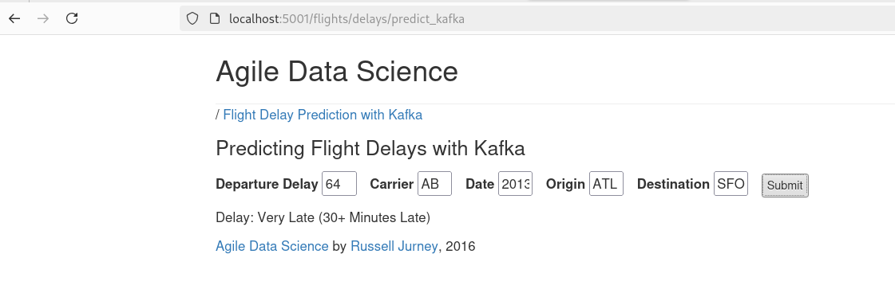
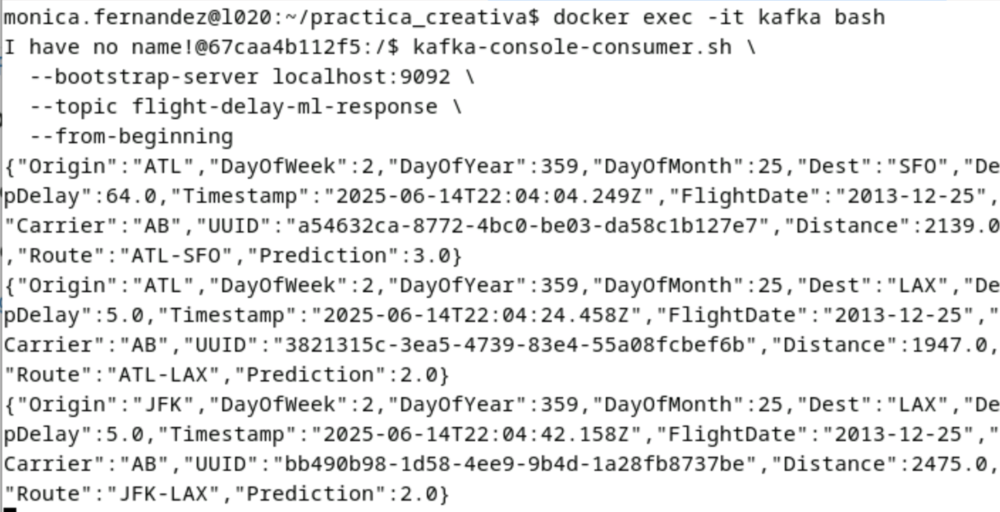
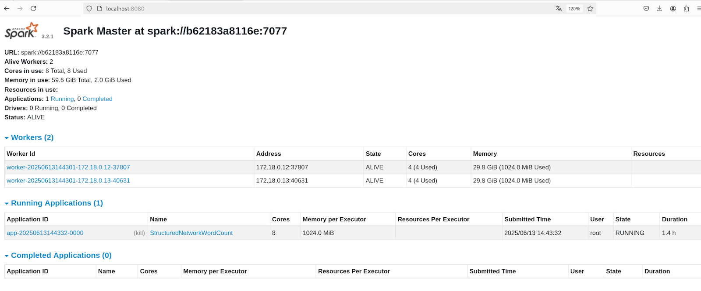
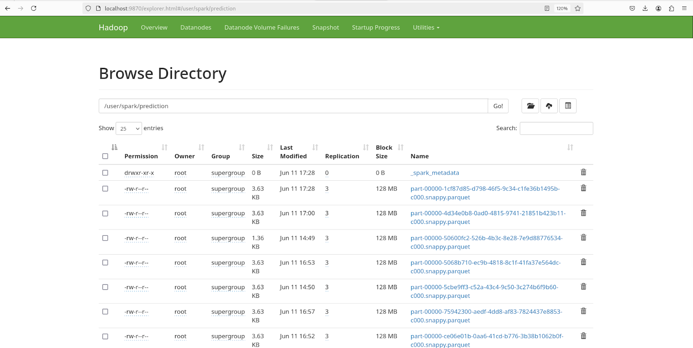
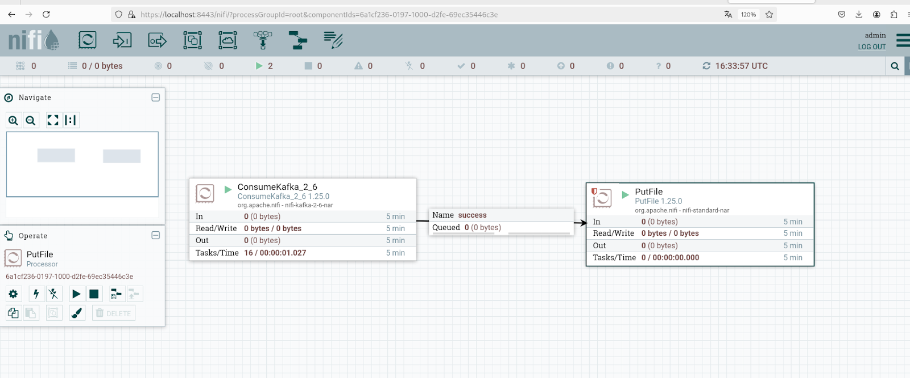
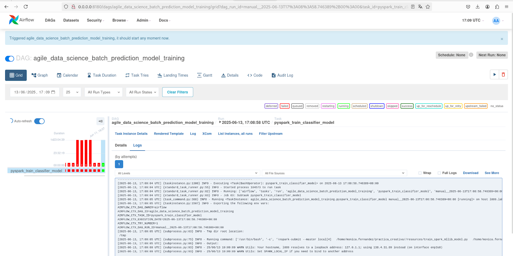
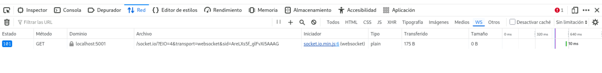
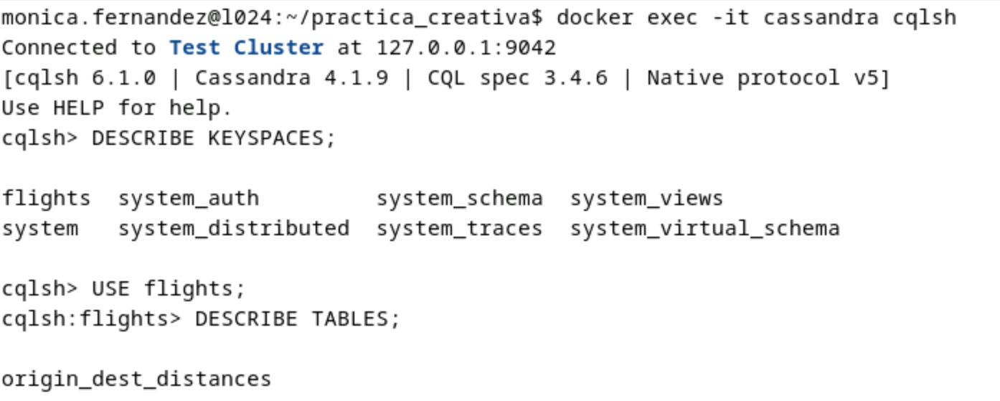
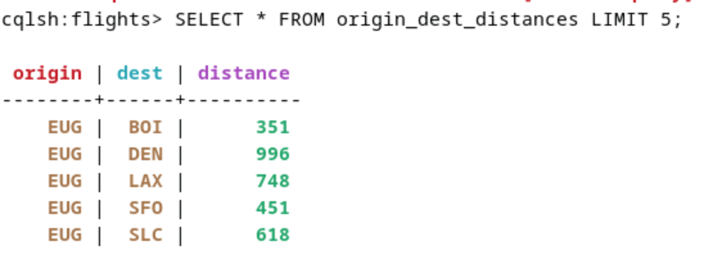

## PRÁCTICA CREATIVA

En esta última práctica de la asignatura de Ingeniería de Big Data en la Nube, se nos pedía implementar una arquitectura completa para predecir retrasos de vuelos en tiempo real utilizando las sigueintes tecnologías: 
 **Docker, Apache Kafka, Apache Spark, NiFi, MongoDB, HDFS, MLflow y Airflow**. A continuación se describe la arquitectura para el correcto despliegue de la práctica.

---

## Arquitectura general

La arquitectura está dockerizada, es decir, cada tecnología está en un contenedor Docker. Esto nos ha permitido poder levantar toda la arquitectura de una vez automatizando el proceso.
Describimos cada una:

- **Flask**: aplicación web donde el usuario introduce los datos del vuelo.
  
  
  
- **Kafka**: sistema de mensajería para enviar/recibir peticiones y respuestas.
  
   
  
- **Spark**: motor de procesamiento que recibe las peticiones, predice y guarda resultados. Interfaz del Spark Master mostrando tareas y ejecución:
  
  
  
- **MongoDB**: almacena las predicciones en base de datos.
  
- **HDFS**: también almacena las predicciones como archivos parquet.
  
Contenido del directorio `/user/spark/prediction` donde Spark almacena los `.parquet`.
  

- **NiFi**: lee las predicciones desde Kafka y las guarda cada 10 segundos en un `.txt`.
  
  
  
- **Docker Compose**: despliega toda la arquitectura.

Hemos desplegado por local atraves de la terminal:

- **MLflow**: guarda los experimentos de entrenamiento.
  
- **Airflow**: automatiza el entrenamiento del modelo con MLflow.
  
  


- **Websockets**: permite comunicación bidireccional en tiempo real entre cliente y servidor sobre una única conexión TCP.
  
  

- **Cassandra**: base de datos NoSQL distribuida diseñada para manejar grandes volúmenes de datos con alta disponibilidad y sin un único punto de falla.
  
  

---


## Cómo ejecutar el sistema

1. **Levantar la arquitectura**:

```bash
docker-compose up --build
```

2. **Acceder a los servicios**:

| Servicio     | URL                      |
|--------------|--------------------------|
| Flask Web App | http://localhost:5001    |
| HDFS         |  http://localhost:9870    |
| NiFi         | https://localhost:8443    |
| Spark        | http://localhost:8080     |
| Airflow      | http://localhost:8180     |

---

## Flujo de datos

1. El usuario introduce un vuelo en la web (Flask).
2. Flask envía los datos al topic de Kafka: `flight-delay-ml-request`.
3. Spark lee esos datos, hace la predicción.
4. Spark guarda la predicción en:
   - MongoDB
   - HDFS
   - Kafka (topic: `flight-delay-ml-response`)
5. La predicción vuelve a Flask en tiempo real desde Kafka.
6. NiFi también lee las predicciones desde Kafka cada 10s y las guarda en un archivo `.txt`.

---

## Entrenamiento del modelo

El modelo se entrena usando un script en PySpark: train_spark_mllib_model.py. Este script:
- Carga un conjunto de datos históricos de vuelos.
- Preprocesa los datos con StringIndexer, Bucketizer, VectorAssembler.
- Entrena un modelo de clasificación RandomForestClassifier.
- Registra métricas y parámetros con MLflow.
- Guarda los modelos entrenados en la carpeta /models.
El entrenamiento se automatiza mediante un DAG de Apache Airflow:
- Airflow ejecuta el script como una tarea programada.
- Se integra con MLflow para registrar cada experimento.
- Los modelos entrenados se reutilizan por Spark para predecir en tiempo real.

Vista del DAG en Airflow:
Registro de experimentos y métricas en MLflow (ejecutado desde terminal).

---

## Funcionalidades implementadas (puntos del examen)

- [x] Dockerizar toda la arquitectura (Flask, Spark, Kafka, Mongo, etc.)
- [x] Publicar predicciones en Kafka y Mongo
- [x] Leer predicciones con NiFi y guardarlas cada 10s en un fichero `.txt`
- [x] Guardar predicciones también en HDFS
- [x] Entrenar el modelo desde Airflow con MLflow

---

## Autores

- [Mónica Fernández Lortal]  
- [Ana Li Camello Serrano]
